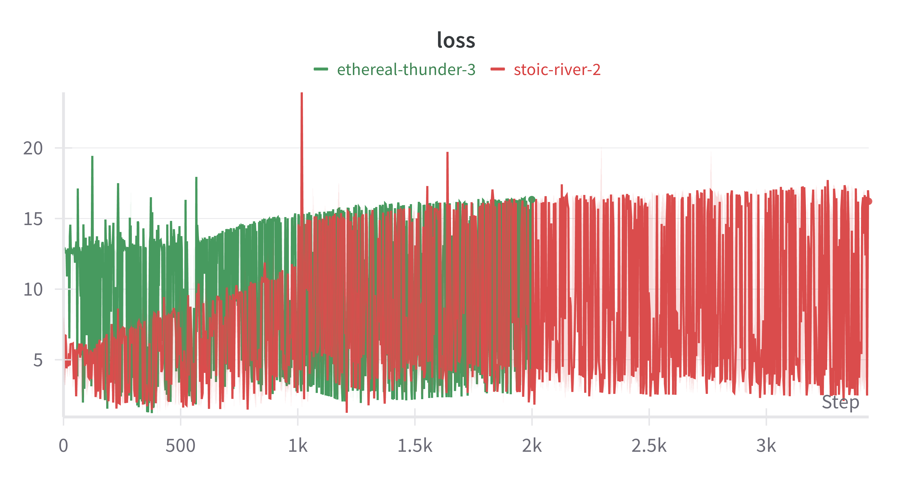

# Mines NLP Class 2025

This github repository is final submission for the Mines NLP Class, given by Georges-André Silber, in January 2025. 

Two projects are implemented here : 
1. Makemore Word Prediction 
2. Group 3 Final Project 

# Makemore Word Prediction

This project implements two different approaches for word prediction using a corpus of text data: a neural network-based approach using a Multi-Layer Perceptron (MLP) and a statistical approach using a probability matrix (bigram model).

## Project Overview

The project aims to predict the next word in a sequence based on the current word. It implements and compares two distinct methodologies:

1. **MLP Approach**: A neural network that learns word relationships through training
2. **Probability Matrix Method**: A statistical approach based on word transition frequencies

## Features

- Text preprocessing and vocabulary building
- Word-to-index mapping for efficient processing
- Wandb integration for experiment tracking
- Training/test split functionality
- Comprehensive evaluation metrics


### MLP Architecture
- Input layer: Vocabulary size (one-hot encoded)
- Hidden layers: 100 -> 50 neurons
- Output layer: Vocabulary size
- Activation function: ReLU
- Loss function: Cross-Entropy
- Optimizer: Adam
- Learning rate: 0.02

### Probability Matrix Method
- Builds a V×V matrix (V = vocabulary size) tracking word transition frequencies
- Computes conditional probabilities P(w_j|w_i) for word transitions
- Predicts next word using maximum likelihood estimation

## Setup and Dependencies

Required Python packages:
```
pandas
numpy
pytorch
tqdm
wandb
pathlib
```

## Usage

1. Place your corpus text files in the `codes` directory with `.md` extension
2. Run the training script:
```python
python train.py
```

## Project Structure

```
project/
│
├── codes/            # Directory containing corpus files
│   └── *.md         # Corpus text files
│
└── train.py         # Main training script
```

## Training Process

The script automatically:
1. Loads and preprocesses the text data
2. Splits data into training (80%) and test (20%) sets
3. Trains both models:
   - MLP: Uses backpropagation with Adam optimizer
   - Probability Matrix: Computes transition frequencies
4. Logs training metrics to Wandb

## Model Comparison

### MLP Advantages and Results
- Can capture more complex patterns
- Better generalization to unseen sequences
- Real-time training metrics via Wandb
**First results** 
Here are the first two training runs, showing the CrossEntropyLoss for the MLP on the bigram task, with different sizes for the MLP.




### Probability Matrix Advantages
- Faster training and inference
- More interpretable results
- Perfect for capturing direct word-to-word relationships

## Monitoring

The project uses Weights & Biases (Wandb) to track:
- Training loss
- Test loss
- Model architecture
- Hyperparameters

## Configuration

Key hyperparameters (configurable in the script):
```python
LR = 0.02
EPOCHS = 1
ARCHI = "MLP_l10l"
DATASET = "codes"
```

## Output

Both models output predictions for the next word given an input word, with the MLP providing probability distributions over the entire vocabulary and the probability matrix giving direct transition probabilities.


# Projet 3
The final pr
View the final project 3 hand-in [here](./project3/notebook_final.ipynb).
